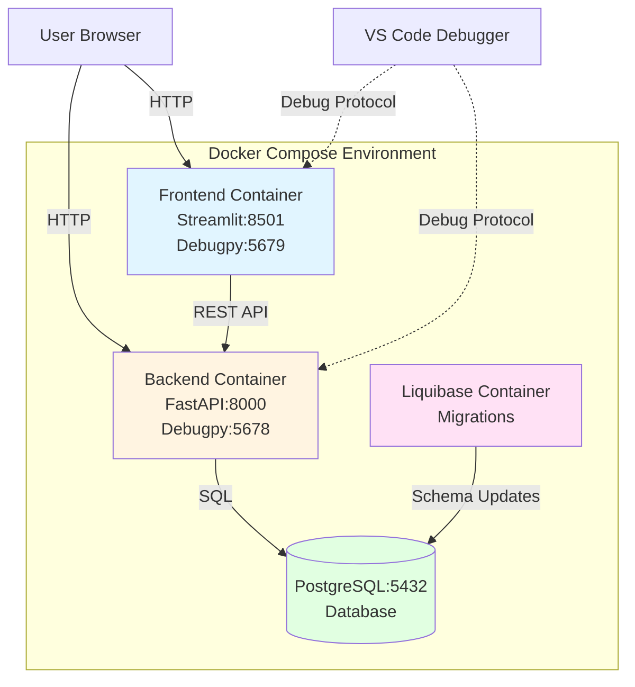

# Proto Stack - Minimal Todo App

A minimal full stack Todo application using Streamlit for the frontend, FastAPI for the backend, and PostgreSQL for the database. The project is configured to use Docker Compose to orchestrate the entire stack for local development and debugging.

## Features

- ✅ Create, read, update, delete (CRUD) operations for todos
- ✅ Mark todos as complete/incomplete
- ✅ Real-time updates between frontend and backend
- ✅ PostgreSQL persistence with Liquibase schema migration for versioned database changes
- ✅ Docker containerization with Docker Compose orchestration
- ✅ VS Code debugging support with debugpy
- ✅ Hot reload for development
- ✅ UV for fast Python package management
- ✅ FastAPI with automatic API documentation

## Prerequisites

The following tools and services are needed to work on this project:

- **Git** - Version control system
- **VS Code** - Recommended code editor with debugging support
- **Docker Desktop** - Container runtime and orchestration
- **UV** (optional) - Fast Python package manager (only needed for local development outside Docker)
- **GitHub CLI** (optional) - For interacting with GitHub from the command line
- **GitHub Account** (optional) - For contributing to the repository
- **Azure CLI** (optional) - Not currently required for this project
- **Azure Account** (optional) - Not currently required for this project

**Minimum required:** Git, VS Code, and Docker Desktop


## Quickstart

The following sections get you quickly up to speed on editing, running, and debugging the application.

### Editing

To get started with development, follow these steps to acquire the code and open it in your editor:

1. **Clone the repository**:
   ```bash
   git clone https://github.com/lambdakris/proto_stack.git
   cd proto_stack
   ```

2. **Sync dependencies** (optional, only needed for local development outside Docker):
   ```bash
   uv sync
   ```
   This command reads the `uv.lock` file and installs all workspace dependencies defined in the root `pyproject.toml` and the backend/frontend `pyproject.toml` files.

3. **Open in VS Code**:
   ```bash
   code .
   ```

### Running

To run the application from VS Code using Docker Compose:

1. **Using VS Code Command Palette**:
   - Press `Ctrl+Shift+P` (or `Cmd+Shift+P` on Mac)
   - Type "Tasks: Run Task"
   - Select "Docker Compose Up"

2. **Using Terminal**:
   ```bash
   docker compose up --build
   ```

**What's happening behind the scenes:**

When you run the application, Docker Compose orchestrates multiple containers in sequence:

- **tasks.json**: VS Code task configuration that defines the `Docker Compose Up` command
- **Build phase** (runs in parallel where possible):
  - Builds the PostgreSQL container from the official `postgres:17` image
  - Builds the Liquibase container from `liquibase/liquibase:4.25` image
  - Builds the backend container from `backend/Dockerfile` using UV to install FastAPI dependencies
  - Builds the frontend container from `frontend/Dockerfile` using UV to install Streamlit dependencies
  
- **Run phase** (runs in sequence based on dependencies):
  1. **PostgreSQL container** starts first and waits for health check (postgres ready)
  2. **Liquibase container** runs once postgres is healthy, applies database migrations, then exits
  3. **Backend container** starts after migrations complete successfully, exposing:
     - Port 8000: FastAPI application
     - Port 5678: Debugpy debug server
  4. **Frontend container** starts after backend is healthy, exposing:
     - Port 8501: Streamlit application
     - Port 5679: Debugpy debug server

3. **Access the application**:
   - Frontend (Streamlit): http://localhost:8501
   - Backend API (FastAPI): http://localhost:8000
   - API Documentation: http://localhost:8000/docs

### Debugging

To debug the application from VS Code with the debugger attached to containers:

1. **Start the stack** using the steps in the [Running](#running) section above

2. **Attach the debugger**:
   - Open the Run and Debug view (`Ctrl+Shift+D` or `Cmd+Shift+D` on Mac)
   - Select one of the debug configurations:
     - `Debug Backend (FastAPI)` - Attaches to backend on port 5678
     - `Debug Frontend (Streamlit)` - Attaches to frontend on port 5679
     - `Debug Full Stack` - Attaches to both services simultaneously
   - Press F5 or click the green play button

3. **Set breakpoints**: Click in the gutter next to line numbers in your Python code (`backend/main.py` or `frontend/main.py`) to set breakpoints

4. **Trigger your code**: Interact with the application through the browser, and the debugger will pause at your breakpoints

**What's happening behind the scenes:**

- **launch.json**: VS Code debug configuration that defines how to attach to remote debug servers
- The docker-compose.yml is configured to run both backend and frontend with debugpy:
  - Backend: `uv run -m debugpy --listen 0.0.0.0:5678 -m fastapi dev main.py`
  - Frontend: `uv run -m debugpy --listen 0.0.0.0:5679 -m streamlit run main.py`
- These debugpy servers wait for VS Code to attach on ports 5678 and 5679
- Once attached, VS Code maps local source files to container paths using `pathMappings`
- You can step through code, inspect variables, and evaluate expressions

## Architecture

This application follows a modern full-stack architecture with clear separation of concerns:

### Components

- **Frontend**: [Streamlit](https://streamlit.io/) - Python web app framework for building interactive data apps
- **Backend**: [FastAPI](https://fastapi.tiangolo.com/) - Modern Python web API framework with automatic OpenAPI documentation
- **Database**: [PostgreSQL](https://www.postgresql.org/) - Robust relational database
- **Schema Migration**: [Liquibase](https://www.liquibase.org/) - Database schema version control and migration
- **Package Management**: [UV](https://docs.astral.sh/uv/) - Fast Python package and project manager
- **Orchestration**: [Docker Compose](https://docs.docker.com/compose/) - Multi-container orchestration
- **Debugging**: VS Code with [debugpy](https://github.com/microsoft/debugpy) - Python debugger support

### System Diagram



### Request Flow

1. User interacts with the Streamlit frontend in their browser (port 8501)
2. Frontend makes REST API calls to the FastAPI backend (port 8000)
3. Backend processes requests and queries PostgreSQL database (port 5432)
4. Database returns data to backend
5. Backend returns JSON responses to frontend
6. Frontend updates the UI for the user

### Development Flow

1. Developer makes code changes in VS Code
2. Docker containers automatically reload on file changes (hot reload)
3. Developer can attach VS Code debugger to containers via ports 5678/5679
4. Database schema changes are managed through Liquibase migrations

## Package Management with UV

This project uses [UV](https://docs.astral.sh/uv/) for Python package management, offering significant advantages over traditional pip/venv workflows:

### Benefits

- **Fast dependency resolution and installation** - 10-100x faster than pip
- **Built-in Python version management** - No need for pyenv or similar tools
- **Project-based dependency management** - Uses `pyproject.toml` standard
- **Workspace support** - Manages monorepo with multiple Python projects
- **Better lockfile handling** - `uv.lock` ensures reproducible builds
- **Compatible with pip** - Can read `requirements.txt` as fallback

### Project Structure

- **Root `pyproject.toml`**: Workspace configuration that includes backend and frontend
- **`backend/pyproject.toml`**: Backend dependencies (FastAPI, SQLAlchemy, psycopg2, etc.)
- **`frontend/pyproject.toml`**: Frontend dependencies (Streamlit, requests, etc.)
- **`uv.lock`**: Locked versions of all dependencies across the workspace

### Common UV Commands

**Install dependencies:**
```bash
# Install all workspace dependencies
uv sync

# Install dependencies for a specific workspace member
cd backend
uv sync

# Install with specific groups (e.g., dev dependencies)
uv sync --group dev
```

**Add new dependencies:**
```bash
# Add a package to backend
cd backend
uv add fastapi-users

# Add a dev dependency
uv add --dev pytest

# Add with specific version
uv add "pydantic>=2.0"
```

**Remove dependencies:**
```bash
cd backend
uv remove package-name
```

**Update dependencies:**
```bash
# Update all dependencies
uv lock --upgrade

# Update specific package
uv lock --upgrade-package fastapi
```

**Run commands in the UV environment:**
```bash
# Run a Python script
uv run python script.py

# Run a module
uv run -m pytest

# Run an installed command
uv run fastapi dev main.py
```

### Workflow Scenarios

**Scenario 1: Starting fresh on a new machine**
```bash
git clone <repository-url>
cd proto_stack
uv sync  # Installs everything from uv.lock
```

**Scenario 2: Adding a new feature that needs a package**
```bash
cd backend
uv add httpx  # Adds httpx to backend/pyproject.toml and updates uv.lock
git add backend/pyproject.toml uv.lock
git commit -m "Add httpx for external API calls"
```

**Scenario 3: Updating to fix a security vulnerability**
```bash
uv lock --upgrade-package vulnerable-package
docker compose build  # Rebuild containers with updated dependencies
```

**Scenario 4: Running backend tests locally**
```bash
cd backend
uv run pytest tests/
```

## Container Orchestration with Docker

This project uses Docker and Docker Compose to provide a consistent development environment across all machines.

### Docker Compose Services

The `docker-compose.yml` defines four services:

1. **postgres** - PostgreSQL database server
2. **liquibase** - Runs database migrations (exits after completion)
3. **backend** - FastAPI application server
4. **frontend** - Streamlit web application

### Common Docker Commands

**Start all services:**
```bash
# Build and start in foreground (see logs)
docker compose up --build

# Start in background (detached mode)
docker compose up -d --build

# Start without rebuilding
docker compose up
```

**Stop services:**
```bash
# Stop all services (keeps containers)
docker compose stop

# Stop and remove containers
docker compose down

# Stop, remove containers, and remove volumes (deletes database data)
docker compose down -v
```

**View logs:**
```bash
# View all service logs
docker compose logs

# Follow logs in real-time
docker compose logs -f

# View logs for specific service
docker compose logs backend
docker compose logs -f frontend

# View last 50 lines
docker compose logs --tail=50
```

**Rebuild services:**
```bash
# Rebuild all services
docker compose build

# Rebuild specific service
docker compose build backend
docker compose build frontend

# Rebuild and start
docker compose up --build backend
```

**Execute commands in running containers:**
```bash
# Run a command in the backend container
docker compose exec backend uv run python -c "print('Hello')"

# Open a bash shell in the backend container
docker compose exec backend bash

# Run a PostgreSQL command
docker compose exec postgres psql -U postgres -d todoapp
```

**Check service status:**
```bash
# List all services and their status
docker compose ps

# View detailed information
docker compose ps -a
```

**View resource usage:**
```bash
# Show CPU/memory usage
docker stats

# Show only proto_stack containers
docker stats $(docker compose ps -q)
```

### Workflow Scenarios

**Scenario 1: Fresh start after pulling changes**
```bash
docker compose down        # Stop and remove old containers
docker compose up --build  # Rebuild with new code and start
```

**Scenario 2: Database is misbehaving, need clean slate**
```bash
docker compose down -v     # Remove containers and volumes
docker compose up --build  # Start fresh with new database
```

**Scenario 3: Testing backend changes without rebuilding frontend**
```bash
docker compose up --build backend  # Only rebuild backend
```

**Scenario 4: Debugging database issues**
```bash
# Check if postgres is healthy
docker compose ps postgres

# View postgres logs
docker compose logs postgres

# Connect to database directly
docker compose exec postgres psql -U postgres -d todoapp

# Run SQL queries
SELECT * FROM todos;
```

**Scenario 5: Cleaning up old images and resources**
```bash
# Remove unused images
docker image prune

# Remove all stopped containers, networks, dangling images
docker system prune

# Full cleanup (careful: removes everything)
docker system prune -a --volumes
```

### Container Build Process

Each service's Dockerfile describes how to build its container:

**Backend/Frontend Dockerfiles:**
1. Start from `ghcr.io/astral-sh/uv:python3.11-bookworm-slim` base image
2. Set working directory to `/app`
3. Install curl for health checks
4. Copy `uv.lock` and `pyproject.toml` 
5. Run `uv sync` to install dependencies
6. Copy application source code
7. Set CMD to run the application with debugpy

**Benefits of this approach:**
- Layer caching: Dependencies are cached separately from source code
- Fast rebuilds: Only source code layer rebuilds when you change code
- Consistent environment: Same Python version and dependencies everywhere

## Schema Management with Liquibase

This project uses [Liquibase](https://www.liquibase.org/) for database schema version control and migrations, ensuring consistent database states across all environments.

### Why Liquibase?

- **Version control for database** - Track schema changes in Git like application code
- **Automated migrations** - Apply changes automatically during deployment
- **Rollback support** - Undo changes if something goes wrong
- **Database independence** - Works across different database systems
- **Team collaboration** - Prevents conflicts when multiple developers change schema

### Migration Files Structure

```
database/liquibase/
├── liquibase.properties              # Connection settings
└── changelogs/
    ├── db.changelog-master.yaml      # Main changelog that includes all versions
    └── v1.0.0/                       # Version-specific directory
        └── 001-create-todos-table.yaml  # Individual migration file
```

### How It Works

1. **Changelog files** define database changes in YAML format
2. **Master changelog** (`db.changelog-master.yaml`) includes all version-specific changelogs
3. **Liquibase container** runs migrations during `docker compose up`
4. **DATABASECHANGELOG table** tracks which migrations have been applied
5. Backend waits for migrations to complete before starting

### Common Liquibase Commands

**Apply migrations:**
```bash
# Apply all pending migrations
./scripts/migrate.sh update

# Or manually with docker compose
docker compose run --rm liquibase update
```

**Check migration status:**
```bash
# View which migrations have been applied
./scripts/migrate.sh status

# Or manually
docker compose run --rm liquibase status
```

**Validate changelog files:**
```bash
# Check for errors in changelog files
./scripts/migrate.sh validate

# Or manually
docker compose run --rm liquibase validate
```

**Rollback migrations:**
```bash
# Rollback last 2 migrations
./scripts/migrate.sh rollback-count 2

# Or manually
docker compose run --rm liquibase rollback-count 2
```

**View migration logs:**
```bash
# View logs from the migration container
docker compose logs liquibase
```

### Workflow Scenarios

**Scenario 1: Adding a new column to todos table**

1. Create a new migration file:
```bash
# Create directory for new version if needed
mkdir -p database/liquibase/changelogs/v1.1.0

# Create migration file
cat > database/liquibase/changelogs/v1.1.0/001-add-due-date.yaml << 'EOF'
databaseChangeLog:
  - changeSet:
      id: add-due-date-column
      author: yourname
      changes:
        - addColumn:
            tableName: todos
            columns:
              - column:
                  name: due_date
                  type: timestamp
                  constraints:
                    nullable: true
EOF
```

2. Update the master changelog:
```yaml
# database/liquibase/changelogs/db.changelog-master.yaml
databaseChangeLog:
  - include:
      file: v1.0.0/001-create-todos-table.yaml
      relativeToChangelogFile: true
  - include:
      file: v1.1.0/001-add-due-date.yaml  # Add this line
      relativeToChangelogFile: true
```

3. Apply the migration:
```bash
./scripts/migrate.sh update
```

4. Verify the change:
```bash
./scripts/migrate.sh status
```

**Scenario 2: Starting with a clean database**

```bash
# Stop all services and remove database volume
docker compose down -v

# Start services (migrations will run automatically)
docker compose up --build
```

**Scenario 3: Checking what will be applied**

```bash
# Ensure postgres is running
docker compose up -d postgres

# Check status
./scripts/migrate.sh status
```

**Scenario 4: Fixing a failed migration**

```bash
# View error logs
docker compose logs liquibase

# Rollback if partially applied
./scripts/migrate.sh rollback-count 1

# Fix the changelog file
vim database/liquibase/changelogs/v1.1.0/001-add-due-date.yaml

# Apply again
./scripts/migrate.sh update
```

**Scenario 5: Creating a new table**

```bash
# Create migration file
cat > database/liquibase/changelogs/v1.1.0/002-create-users-table.yaml << 'EOF'
databaseChangeLog:
  - changeSet:
      id: create-users-table
      author: yourname
      changes:
        - createTable:
            tableName: users
            columns:
              - column:
                  name: id
                  type: serial
                  constraints:
                    primaryKey: true
              - column:
                  name: username
                  type: varchar(50)
                  constraints:
                    nullable: false
                    unique: true
              - column:
                  name: email
                  type: varchar(100)
                  constraints:
                    nullable: false
              - column:
                  name: created_at
                  type: timestamp
                  defaultValueComputed: CURRENT_TIMESTAMP
EOF

# Update master changelog and apply
vim database/liquibase/changelogs/db.changelog-master.yaml
./scripts/migrate.sh update
```

### Best Practices

1. **Never modify applied migrations** - Create new migrations to change schema
2. **Use descriptive IDs** - Make changeSet IDs clear and meaningful
3. **Version your migrations** - Group related changes in version directories
4. **Test rollbacks** - Ensure your changes can be rolled back if needed
5. **One change per changeSet** - Makes it easier to track and rollback
6. **Use preconditions** - Add checks to prevent invalid migrations
7. **Document complex changes** - Add comments explaining why changes were made

## Project Structure

```
proto_stack/
├── backend/                 # FastAPI backend
│   ├── main.py             # FastAPI application
│   ├── pyproject.toml      # Python dependencies (UV format)
│   ├── requirements.txt    # Python dependencies (fallback)
│   └── Dockerfile          # Backend container config
├── frontend/               # Streamlit frontend
│   ├── app.py             # Streamlit application
│   ├── pyproject.toml      # Python dependencies (UV format) 
│   ├── requirements.txt   # Python dependencies (fallback)
│   └── Dockerfile         # Frontend container config
├── database/              # Database configuration
│   ├── init.sql          # Database initialization
│   ├── Dockerfile.liquibase # Liquibase container config
│   └── liquibase/        # Liquibase migration files
│       ├── liquibase.properties
│       └── changelogs/   # Database changelog files
│           ├── db.changelog-master.yaml
│           └── v1.0.0/   # Version-specific migrations
├── scripts/              # Utility scripts
│   └── migrate.sh       # Database migration script
├── .vscode/              # VS Code configuration
│   ├── launch.json       # Debug configurations
│   └── tasks.json        # Build tasks
├── docker-compose.yml    # Docker Compose orchestration
├── docker-compose.override.yml # Development overrides
├── pyproject.toml        # UV workspace configuration
├── .env                  # Environment variables
└── README.md            # This file
```

## API Endpoints

The FastAPI backend provides the following REST endpoints:

- `GET /` - Health check endpoint, returns `{"message": "Todo API is running"}`
- `GET /todos` - List all todos
- `POST /todos` - Create a new todo
  - Body: `{"title": "string", "description": "string"}`
- `PUT /todos/{id}` - Update a todo
  - Body: `{"title": "string", "description": "string", "completed": boolean}` (all fields optional)
- `DELETE /todos/{id}` - Delete a todo

Interactive API documentation is available at http://localhost:8000/docs when the backend is running.

## Common Issues and Troubleshooting

### Database Connection Issues

**Symptom**: Backend fails to connect to database, errors like "could not connect to server"

**Solutions**:
```bash
# Check if PostgreSQL container is running and healthy
docker compose ps postgres

# Should show "healthy" status
# If not healthy, check logs
docker compose logs postgres

# Check if port 5432 is available
netstat -an | grep 5432

# Restart postgres
docker compose restart postgres

# If issues persist, recreate with fresh data
docker compose down -v
docker compose up --build
```

### Database Migration Issues

**Symptom**: Backend won't start, migrations fail, or "relation does not exist" errors

**Solutions**:
```bash
# Check migration status
./scripts/migrate.sh status

# Validate changelog files
./scripts/migrate.sh validate

# View migration logs
docker compose logs liquibase

# If migrations are stuck, recreate database
docker compose down -v
docker compose up --build

# For manual migration control
docker compose up -d postgres
./scripts/migrate.sh update
```

### Port Conflicts

**Symptom**: "Port already in use" or "address already in use" errors

**Solutions**:
```bash
# Check what's using the ports
# Linux/Mac:
lsof -i :8000  # Backend
lsof -i :8501  # Frontend
lsof -i :5432  # Database
lsof -i :5678  # Backend debugger
lsof -i :5679  # Frontend debugger

# Windows:
netstat -ano | findstr :8000

# Kill the process or change ports in docker-compose.yml
# Example: Change backend port from 8000:8000 to 8080:8000
```

### Debugging Not Working

**Symptom**: VS Code can't attach to debugger, or "ECONNREFUSED" errors

**Solutions**:
```bash
# 1. Ensure containers are running with debug ports exposed
docker compose ps

# Should show ports 5678 and 5679 mapped
# 2. Check if debugpy is listening
docker compose logs backend | grep debugpy
docker compose logs frontend | grep debugpy

# 3. Check firewall isn't blocking ports 5678, 5679
# Windows: Check Windows Firewall
# Mac: Check System Preferences > Security & Privacy > Firewall

# 4. Restart containers
docker compose restart backend frontend

# 5. Verify path mappings in .vscode/launch.json are correct
cat .vscode/launch.json
```

### Container Build Failures

**Symptom**: "Error building image" or dependency installation failures

**Solutions**:
```bash
# Clear Docker build cache
docker builder prune

# Rebuild without cache
docker compose build --no-cache backend
docker compose build --no-cache frontend

# Check disk space
df -h

# Clean up Docker resources
docker system prune -a

# Check if uv.lock is corrupted
uv lock --check

# Regenerate lock file if needed
uv lock
```

### Hot Reload Not Working

**Symptom**: Code changes don't appear when refreshing browser

**Solutions**:
```bash
# 1. Check if volumes are mounted correctly
docker compose config

# Should show volume mounts for ./backend and ./frontend

# 2. Ensure you're editing files in the correct location
pwd  # Should be in proto_stack directory

# 3. Restart the specific service
docker compose restart backend  # For backend changes
docker compose restart frontend  # For frontend changes

# 4. For Streamlit, make sure to refresh browser after change
# Backend (FastAPI dev mode) should auto-reload
```

### Performance Issues

**Symptom**: Application is slow, containers using too much CPU/memory

**Solutions**:
```bash
# Check resource usage
docker stats

# If postgres is using too much memory, adjust in docker-compose.yml:
# Add under postgres service:
#   deploy:
#     resources:
#       limits:
#         memory: 512M

# Check logs for errors that might cause loops
docker compose logs -f

# Restart services
docker compose restart
```

### Can't Access Application in Browser

**Symptom**: Browser shows "This site can't be reached" or connection refused

**Solutions**:
```bash
# 1. Check if containers are running
docker compose ps

# All should show "Up" status
# 2. Check if services are healthy
docker compose ps backend frontend

# 3. Check logs for startup errors
docker compose logs backend
docker compose logs frontend

# 4. Verify you're using correct URLs
# Frontend: http://localhost:8501
# Backend: http://localhost:8000

# 5. Check if Docker Desktop is running (if on Windows/Mac)

# 6. Try accessing from container IP directly
docker compose exec backend curl http://localhost:8000
```

### General Debugging Steps

When encountering any issue:

1. **Check service status**: `docker compose ps`
2. **View logs**: `docker compose logs [service]`
3. **Check resource usage**: `docker stats`
4. **Verify network**: `docker network ls` and `docker network inspect proto_stack_default`
5. **Clean slate**: `docker compose down -v && docker compose up --build`
6. **Check GitHub issues**: Search the repository issues for similar problems
7. **Enable verbose logging**: Set environment variables in docker-compose.yml:
   ```yaml
   environment:
     LOG_LEVEL: DEBUG
   ```

## Screenshots

### Application Interface

The Streamlit frontend provides a clean, intuitive interface for managing todos:


### Working Application

Here's the application in action with multiple todos, showing the complete/incomplete functionality:


